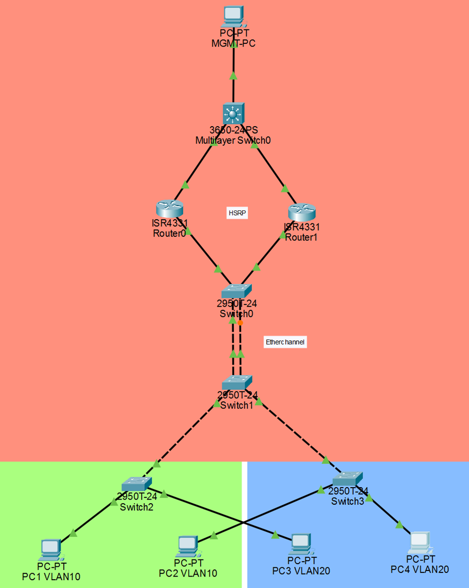

# Network Automation Lab

Follow the steps in order: 
1) Run serial baselines to set device management IPs and enable SSH
2) Run Ansible playbooks to apply the network configuration.

## Exact inventory (from `ansible/hosts`)

Use these hostnames and management IPs when prompted by the baseline scripts or when targeting with Ansible:

- l3
  - `sw1` — 10.0.99.10

- router
  - `r1` — 10.0.99.2
  - `r2` — 10.0.99.3

- agg
  - `sw2` — 10.1.99.10
  - `sw3` — 10.1.99.11

- access
  - `sw4` — 10.1.99.12
  - `sw5` — 10.1.99.13

Group variables (inventory-level defaults from `ansible/hosts`):

- `ansible_network_os=cisco.ios.ios`
- `ansible_connection=network_cli`
- `ansible_user=cisco`
- `ansible_password=cisco`
- `ansible_become=yes`
- `ansible_become_method=enable`
- `ansible_become_password=cisco`


## Devices used (physical models)

This lab was built using the following physical devices. When reproducing the lab, use equivalent hardware or virtual devices that support the same IOS features (subinterfaces, HSRP, SVIs):

- Routers (2): Cisco 4221
  - `r1` — Cisco 4221 (management IP 10.0.99.2)
  - `r2` — Cisco 4221 (management IP 10.0.99.3)

- L3 switch (1): Catalyst 3650
  - `sw1` — Catalyst 3650 (management IP 10.0.99.10)

- L2 switches (4): Catalyst 2960 / Catalyst 1000 series
  - `sw2` — Catalyst 2960 (management IP 10.1.99.10)
  - `sw3` — Catalyst 2960 (management IP 10.1.99.11)
  - `sw4` — Catalyst 1000 (management IP 10.1.99.12)
  - `sw5` — Catalyst 1000 (management IP 10.1.99.13)


## Cabling (as defined by the Ansible playbooks)

The topology and interface endpoints are derived directly from the `ansible/playbooks/*` files. Wire the lab so the physical port pairs below match the playbook expectations.

Corrected topology mapping (per your update):

- sw1 Gi1/0/23  <-->  r1  Gi0/0/0
- sw1 Gi1/0/24  <-->  r2  Gi0/0/0

- r1 Gi0/0/1   <-->  sw2 Gi0/0/23
- r2 Gi0/0/1   <-->  sw2 Gi0/0/24

- sw2 Gi0/21  <-->  sw3 Gi0/21   (EtherChannel member)
- sw2 Gi0/22  <-->  sw3 Gi0/22   (EtherChannel member)
  - These two cables form `Port-channel10` between `sw2` and `sw3` (EtherChannel)

- sw3 Gi0/23  <-->  sw4 Gi1/0/24   (single cable)
- sw3 Gi0/24  <-->  sw5 Gi1/0/24   (single cable)

Notes:
- Playbooks use several different slot/slot/module numbering conventions (for example `Gi0/0/x` and `Gi1/0/x`). Use the interface labels printed on your physical devices; match the playbook's interface names when you configure/plug cables.
- If you use virtual devices, ensure your virtual topology creates the same logical port mapping (for example connect switch virtual interface `Gi0/23` to router `Gi0/0/0`).

### ASCII topology (human-readable)

Below is a compact ASCII diagram that matches the attached topology image and the interface/cabling mappings above. The management/HSRP triangle is at the top, aggregation and access layers below.

```
                 MGMT-PC
                   |
               sw1 (3650)  (management SVI: 10.0.99.10)
               /        \
             /            \
         r1(4221)       r2(4221)
            \             /
             \           /
               \       /
                sw2 (agg)
                 ||   ||   <-- EtherChannel (2 cables) to sw3
                 ||   ||
                sw3 (agg)
               /    \
              /      \
          sw4        sw5   (access switches, single links)

Key:
- `sw1` — L3 switch (3650)
- `r1`, `r2` — routers (4221) forming HSRP
- `sw2`, `sw3` — aggregation switches with EtherChannel between them
- `sw4`, `sw5` — access switches with VLAN10/VLAN20 access ports
```


_Figure: Lab topology (sw1↔r1/r2 → r1/r2↔sw2 → sw2↔sw3 (EtherChannel) → sw3↔sw4/sw5)._ 

## Important sequencing requirement

The serial baseline must be completed on each device before attempting to run Ansible across the fleet. Baseline (Step A) configures management IPs, enables SSH, and creates the local admin user that Ansible uses.

Run Step A on every device first — only then run the Ansible playbooks in the sequence below.

## Prerequisites (Windows PowerShell)

Install Python packages and Ansible collection used by the playbooks:

```powershell
python -m pip install --upgrade pip
pip install pyserial
pip install ansible
ansible-galaxy collection install cisco.ios
```

Also make sure you have a working serial console connection (USB-to-serial) and know the COM port (for example `COM3`).

## Step A — Serial baseline (initial console setup)

Run the appropriate baseline script for each device. The baseline scripts are in the `baseline/` folder and are interactive. When you run them, enter the values below to match the Ansible inventory exactly.

Notes about defaults used by the scripts:
- Enable secret (default shown at prompt): `cisco`
- Local admin username/password defaults: `cisco` / (you will be prompted to enter the password)

1) Router baseline — `r1` (example using COM3)

```powershell
python baseline\baselineRU.py
```

When prompted, enter these values to match `ansible/hosts`:
- Serial port: `COM3` (replace if your port is different)
- Hostname: `r1`
- Enable secret: `cisco` (or press Enter to accept default)
- Local admin username: `cisco`
- Password for local admin: (choose a password, `cisco` is expected in inventory; use `cisco` for exact replication)
- Management interface (example): `GigabitEthernet0/0/1` (script accepts case-insensitive; common example)
- Management IP address: `10.0.99.2`
- Management subnet mask: `255.255.255.0`

After the script finishes, SSH should be available at `ssh cisco@10.0.99.2`.

2) Router baseline — `r2`

Repeat for `r2` (adjust COM port as needed):

```powershell
python baseline\baselineRU.py
```

Prompt values (to match inventory):
- Hostname: `r2`
- Management IP address: `10.0.99.3`
- Management subnet mask: `255.255.255.0`
- Other prompts: same defaults as for `r1` (enable secret, local admin `cisco`, etc.)

3) Switch baseline — `sw1`

```powershell
python baseline\baselineSW.py
```

Prompt values to match inventory (sw1 is on 10.0.99.0 mgmt network):
- Serial port: `COM3` (or your COM port)
- Hostname: `sw1`
- Enable secret: `cisco`
- Local admin account: `cisco` (password enter `cisco` to match inventory)
- MGMT VLAN ID: `99`
- MGMT IP: `10.0.99.10`
- MGMT network mask: `255.255.255.0`
- MGMT default-gateway: `10.0.99.1` (HSRP virtual IP — configured by routers)
- Trunk ports: follow prompts, e.g. `Gi0/1` or the physical ports connected to uplinks

4) Switch baselines — `sw2`, `sw3`, `sw4`, `sw5`

Run `baselineSW.py` for each switch and enter the inventory IPs:

- `sw2` → MGMT IP `10.1.99.10`
- `sw3` → MGMT IP `10.1.99.11`
- `sw4` → MGMT IP `10.1.99.12`
- `sw5` → MGMT IP `10.1.99.13`

For switches in the 10.1.99.0 network, set the MGMT default gateway to whatever gateway your lab uses (if you replicate exactly, ensure routers provide reachability). If you plan to centralize management on the 10.0.99 network, adjust accordingly.

Verification after serial baselines

From your management PC, verify SSH connectivity:

```powershell
ssh cisco@10.0.99.2   # r1
ssh cisco@10.0.99.3   # r2
ssh cisco@10.0.99.10  # sw1
ssh cisco@10.1.99.10  # sw2
```

If SSH fails, re-check the serial step output to confirm RSA key generation and `ip address` configuration.


## Step B — Apply configuration with Ansible (follow this exact order)

After Step A (serial baseline) is complete on every device, run the Ansible playbooks in the sequence required by the topology and playbook dependencies.

1) Start with `sw1` (L3-switch / management VLAN)

```powershell
ansible-playbook -i ansible/hosts ansible/playbooks/sw1.yml
```

2) Run routers `r1` and `r2` (they provide HSRP/virtual gateways used by switches)

```powershell
ansible-playbook -i ansible/hosts ansible/playbooks/r1.yml
ansible-playbook -i ansible/hosts ansible/playbooks/r2.yml
```

3) Aggregation / distribution switches `sw2` and `sw3`

```powershell
ansible-playbook -i ansible/hosts ansible/playbooks/sw2.yml
ansible-playbook -i ansible/hosts ansible/playbooks/sw3.yml
```

4) Access switches `sw4` and `sw5` (last)

```powershell
ansible-playbook -i ansible/hosts ansible/playbooks/sw4-5.yml
```

This ordering ensures `sw1` is configured first (management VLAN/SVI present), routers then provide gateway/HSRP, aggregation switches configure port-channels and trunks, and finally access switches are configured last.

Notes about the playbooks

- Playbooks use `cisco.ios.ios_config` to push configuration snippets. The `r1.yml` and `r2.yml` playbooks create subinterfaces and HSRP groups (example virtual IP 10.0.99.1 on subinterface `.99`).
- `sw1.yml` creates VLAN 99 and applies trunking to uplink ports used for management.

## Verification after Ansible

- Confirm HSRP/virtual gateway is present from a switch: `show standby brief` (on routers/switches via SSH).
- From your management PC, ping the virtual gateway if configured (example `10.0.99.1`).

## Troubleshooting

- If ansible-playbook fails with authentication errors, verify `ansible/hosts` contains `ansible_user`/`ansible_password=cisco` or adjust to the password you set when running the baseline scripts.
- If serial scripts hang or commands look truncated, increase timeouts in `baseline/*.py` functions `open_serial()` and `send_cmd()`.
- If a playbook fails due to module not found, ensure `cisco.ios` collection is installed:

```powershell
ansible-galaxy collection install cisco.ios
```

## Notes & safety

- The instructions above intentionally use the exact IPs and default lab credentials present in this repository to enable reproducibility. Change the credentials and secrets before using the code in production.